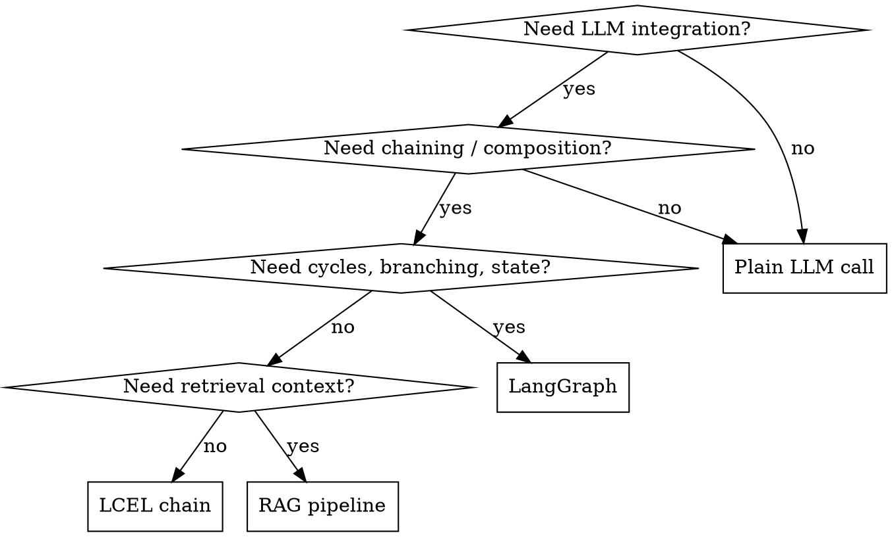

# LangChain Pattern Skill

Enforce idiomatic LangChain architecture so applications are composable, observable, and production-ready.

> **Core principle:** Use LangChain Expression Language (LCEL) chains as the default composition primitive.
> Reach for LangGraph only when you need cycles, branching, or persistent state.

## When to Use

- Building or modifying any LangChain-based application
- Creating RAG pipelines, agents, tool-calling flows, or structured output
- Integrating LangSmith tracing for observability
- Reviewing existing LangChain code for pattern compliance
- Migrating from legacy chains (LLMChain, SequentialChain) to LCEL

**When NOT to use:**
- Non-LangChain LLM code (plain API calls, other frameworks)
- Simple one-shot prompts with no chaining or retrieval

## Architecture Decision Flowchart



## Core Patterns

### 1. LCEL as Default Composition

Always compose with the `|` (pipe) operator. Never subclass `Chain` or use legacy wrappers.

```python
from langchain_core.prompts import ChatPromptTemplate
from langchain_core.output_parsers import StrOutputParser
from langchain_openai import ChatOpenAI

prompt = ChatPromptTemplate.from_messages([
    ("system", "You are a helpful assistant."),
    ("human", "{input}"),
])
llm = ChatOpenAI(model="gpt-4o")

chain = prompt | llm | StrOutputParser()
result = chain.invoke({"input": "Explain LCEL in one sentence."})
```

**Why:** LCEL chains are automatically streamable, batchable, and traceable via LangSmith with zero extra code.

### 2. Structured Output with Pydantic

Use `llm.with_structured_output(Schema)` instead of manual JSON parsing.

```python
from pydantic import BaseModel, Field

class ExtractedEntity(BaseModel):
    name: str = Field(description="Entity name")
    category: str = Field(description="Entity category")

structured_llm = llm.with_structured_output(ExtractedEntity)
result = structured_llm.invoke("Apple released the new iPhone.")
# result is an ExtractedEntity instance
```

### 3. RAG Pipeline

Use the retriever interface — never query vector stores directly in chain logic.

```python
from langchain_core.runnables import RunnablePassthrough

retriever = vectorstore.as_retriever(search_kwargs={"k": 4})

rag_chain = (
    {"context": retriever | format_docs, "question": RunnablePassthrough()}
    | prompt
    | llm
    | StrOutputParser()
)
```

**Key rules:**
- Embed and retrieve with the same model
- Always set `k` explicitly
- Use `RunnablePassthrough` to thread inputs through parallel branches

### 4. Tool-Calling Agents

Use `create_react_agent` from LangGraph (not the legacy `initialize_agent`).

```python
from langgraph.prebuilt import create_react_agent

tools = [search_tool, calculator_tool]
agent = create_react_agent(llm, tools)
result = agent.invoke({"messages": [("human", "What is 2+2?")]})
```

**Key rules:**
- Define tools with `@tool` decorator and clear docstrings
- Prefer `create_react_agent` for simple tool use
- Use full LangGraph `StateGraph` only when you need custom control flow

### 5. LangGraph for Complex Flows

Use `StateGraph` when you need cycles, conditional routing, or persistent memory.

```python
from langgraph.graph import StateGraph, MessagesState, START, END

graph = StateGraph(MessagesState)
graph.add_node("agent", call_model)
graph.add_node("tools", tool_node)
graph.add_edge(START, "agent")
graph.add_conditional_edges("agent", should_continue, {"continue": "tools", "end": END})
graph.add_edge("tools", "agent")

app = graph.compile(checkpointer=memory)
```

### 6. LangSmith Observability

Always configure tracing in production and development.

```python
import os
os.environ["LANGCHAIN_TRACING_V2"] = "true"
os.environ["LANGCHAIN_API_KEY"] = "<key>"
os.environ["LANGCHAIN_PROJECT"] = "my-project"
```

All LCEL chains and LangGraph graphs are automatically traced — no code changes needed.

## Quick Reference

| Task | Pattern | Avoid |
|------|---------|-------|
| Simple chain | `prompt \| llm \| parser` (LCEL) | `LLMChain`, `SequentialChain` |
| Structured output | `llm.with_structured_output(Schema)` | Manual JSON parsing |
| RAG | `retriever \| format \| llm` | Direct vectorstore queries in chain |
| Simple agent | `create_react_agent(llm, tools)` | `initialize_agent` |
| Complex flow | `StateGraph` (LangGraph) | Nested LCEL with hacky branching |
| Tracing | `LANGCHAIN_TRACING_V2=true` | Print-debugging |
| Streaming | `chain.stream()` / `chain.astream()` | Collecting full response then sending |
| Batch | `chain.batch([...])` | Loop with `.invoke()` |

## Common Mistakes

| Mistake | Fix |
|---------|-----|
| Using legacy `LLMChain` or `SequentialChain` | Migrate to LCEL pipe syntax |
| Subclassing `Chain` for custom logic | Use `RunnableLambda` or LangGraph |
| Parsing JSON from raw LLM text | Use `.with_structured_output()` |
| Using `initialize_agent` | Use `create_react_agent` from LangGraph |
| Ignoring streaming support | Use `.stream()` / `.astream()` — LCEL supports it natively |
| Hardcoding prompts as strings | Use `ChatPromptTemplate` for reusability and tracing |
| No observability in production | Enable LangSmith tracing from day one |
| Putting business logic inside prompts | Keep prompts declarative; use tools/code for logic |

## Migration Checklist (Legacy to Current)

- [ ] Replace `LLMChain` with LCEL `prompt | llm | parser`
- [ ] Replace `SequentialChain` with LCEL pipe composition
- [ ] Replace `initialize_agent` with `create_react_agent`
- [ ] Replace manual JSON parsing with `.with_structured_output()`
- [ ] Replace `ConversationBufferMemory` with LangGraph `checkpointer`
- [ ] Enable LangSmith tracing
- [ ] Use `langchain-<provider>` packages instead of monolithic `langchain`
