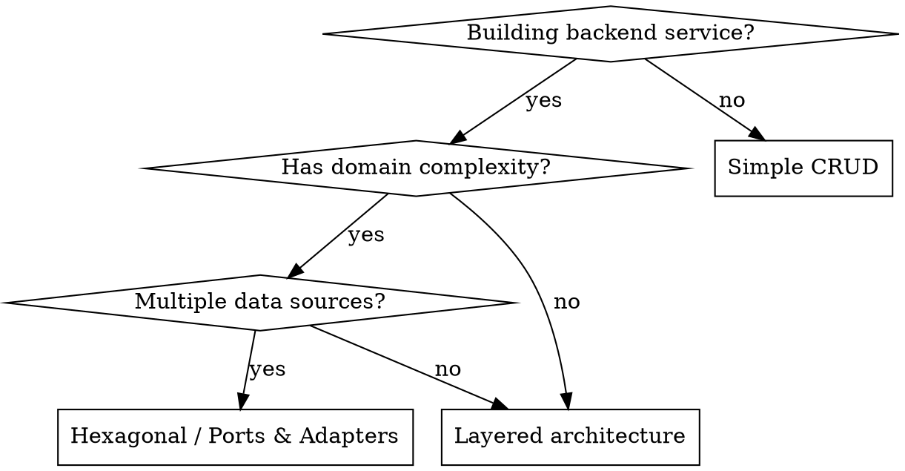

# OOP Backend Design Skill

Enforce clean object-oriented architecture in backend services so code is testable, extensible, and maintainable.

> **Core principle:** Depend on abstractions, not concretions. Every layer should be replaceable
> without rewriting the layers above or below it.

## When to Use

- Designing a new backend service or API
- Adding a feature that introduces a new domain concept
- Refactoring tangled business logic out of controllers/routes
- Reviewing backend code for architectural compliance
- Choosing between design patterns for a specific problem
- Structuring domain models, repositories, or service layers

**When NOT to use:**
- Frontend-only code
- Scripts, CLIs, or one-off automation
- Prototypes where architecture is explicitly deferred
- Truly trivial CRUD apps where a single file with direct DB access is clearer

## Architecture Decision Flowchart



## SOLID Principles — Quick Reference

| Principle | Rule | Violation Signal |
|-----------|------|------------------|
| **S** — Single Responsibility | One class, one reason to change | Class has methods touching unrelated concerns |
| **O** — Open/Closed | Extend behavior without modifying existing code | Adding a feature requires editing existing classes |
| **L** — Liskov Substitution | Subtypes must be substitutable for their base | Overridden method changes expected behavior |
| **I** — Interface Segregation | No client forced to depend on unused methods | Interface has methods only some implementers use |
| **D** — Dependency Inversion | High-level modules depend on abstractions | Service directly instantiates a database client |

## Core Patterns

### 1. Layered Architecture

The default structure for most backend services. Each layer depends only on the layer below it.

```
Controller / Route    ← HTTP concerns only (parse request, return response)
    ↓
Service Layer         ← Business logic, orchestration, validation
    ↓
Repository Layer      ← Data access abstraction
    ↓
Data Source            ← Database, API, file system
```

**Rules:**
- Controllers never contain business logic
- Services never import HTTP or framework-specific types
- Repositories expose domain-oriented interfaces, not raw queries

### 2. Repository Pattern

Abstract data access behind an interface so the service layer is storage-agnostic.

```python
from abc import ABC, abstractmethod

class UserRepository(ABC):
    @abstractmethod
    def find_by_id(self, user_id: str) -> User | None: ...

    @abstractmethod
    def save(self, user: User) -> User: ...

class PostgresUserRepository(UserRepository):
    def __init__(self, session: Session):
        self._session = session

    def find_by_id(self, user_id: str) -> User | None:
        return self._session.query(UserModel).filter_by(id=user_id).first()

    def save(self, user: User) -> User:
        self._session.add(user)
        self._session.flush()
        return user
```

**Why:** Swap Postgres for DynamoDB, add caching, or use an in-memory store for tests — all without touching service code.

### 3. Service Layer

Orchestrate business logic. Services depend on repository abstractions, not implementations.

```python
class UserService:
    def __init__(self, user_repo: UserRepository, email_service: EmailService):
        self._user_repo = user_repo
        self._email_service = email_service

    def register(self, name: str, email: str) -> User:
        existing = self._user_repo.find_by_email(email)
        if existing:
            raise DuplicateEmailError(email)

        user = User(name=name, email=email)
        saved = self._user_repo.save(user)
        self._email_service.send_welcome(saved)
        return saved
```

**Rules:**
- Accept dependencies via constructor (dependency injection)
- Raise domain exceptions, not HTTP exceptions
- Keep methods focused — one business operation per method

### 4. Dependency Injection

Wire dependencies at the composition root (app startup), not inside classes.

```python
# composition root — app.py or container.py
session = create_session()
user_repo = PostgresUserRepository(session)
email_service = SmtpEmailService(config.smtp)
user_service = UserService(user_repo, email_service)

# in tests
fake_repo = InMemoryUserRepository()
fake_email = FakeEmailService()
user_service = UserService(fake_repo, fake_email)
```

**Why:** Classes don't know or care what concrete implementation they receive. Testing is trivial.

### 5. Domain Model

Rich domain objects encapsulate business rules. Avoid anemic models (data-only classes with external logic).

```python
class Order:
    def __init__(self, items: list[OrderItem]):
        self._items = items
        self._status = OrderStatus.DRAFT

    def add_item(self, item: OrderItem) -> None:
        if self._status != OrderStatus.DRAFT:
            raise OrderFrozenError()
        self._items.append(item)

    @property
    def total(self) -> Decimal:
        return sum(item.subtotal for item in self._items)

    def submit(self) -> None:
        if not self._items:
            raise EmptyOrderError()
        self._status = OrderStatus.SUBMITTED
```

**Rules:**
- Business rules live on the domain object, not in the service
- Use value objects for concepts with no identity (Money, Address, DateRange)
- Domain objects never depend on infrastructure

### 6. Hexagonal Architecture (Ports & Adapters)

For complex services with multiple external integrations. Define ports (interfaces) at the domain boundary, implement adapters externally.

```
           ┌──────────────────────────┐
Adapters   │  HTTP   CLI   Queue      │  ← Driving adapters (input)
           └──────────┬───────────────┘
                      │
Ports      ┌──────────▼───────────────┐
           │  Use Cases / Services    │  ← Application core
           │  Domain Models           │
           └──────────┬───────────────┘
                      │
Ports      ┌──────────▼───────────────┐
Adapters   │  DB   Cache   Email API  │  ← Driven adapters (output)
           └──────────────────────────┘
```

**When to use:** Multiple input channels (HTTP + CLI + queue), multiple storage backends, or when domain logic must be completely framework-independent.

## Design Pattern Quick Reference

| Problem | Pattern | When to Use |
|---------|---------|-------------|
| Object creation complexity | **Factory** | Multiple variants, complex setup, conditional creation |
| Swappable algorithms | **Strategy** | Behavior varies at runtime (pricing, sorting, auth) |
| Cross-cutting concerns | **Decorator** | Logging, caching, retry — without modifying core class |
| Event-driven decoupling | **Observer / Event Bus** | Side effects that shouldn't block the main flow |
| Complex object construction | **Builder** | Many optional parameters, step-by-step construction |
| Single shared resource | **Singleton** | Connection pools, config — use sparingly |
| Incompatible interfaces | **Adapter** | Wrapping third-party libraries behind your own interface |

## Common Mistakes

| Mistake | Fix |
|---------|-----|
| Business logic in controllers | Move to service layer; controller only parses/returns |
| God class / God service | Split by domain concept (UserService, OrderService) |
| Anemic domain model | Move business rules onto the domain object |
| Direct `new` in service constructors | Inject dependencies via constructor |
| Catching all exceptions generically | Define domain exceptions; let infrastructure errors propagate |
| Circular dependencies between services | Introduce an interface or event to break the cycle |
| Over-engineering simple CRUD | Not everything needs hexagonal architecture — match complexity to the problem |
| Skipping the repository layer for complex apps | For apps with multiple data sources or complex queries, the abstraction pays off in testability. For truly trivial single-table CRUD, direct data access in the service layer is acceptable — add the abstraction when complexity grows. |

## Code Review Checklist

- [ ] Controllers contain no business logic
- [ ] Services depend on abstractions (interfaces/protocols), not concrete classes
- [ ] Domain objects enforce their own invariants
- [ ] Dependencies are injected, not instantiated internally
- [ ] No circular dependencies between modules
- [ ] Each class has a single, clear responsibility
- [ ] Domain exceptions are used instead of HTTP status codes in service layer
- [ ] Tests use fakes/mocks injected through the same interfaces
- [ ] No framework-specific imports in domain or service layers
- [ ] Value objects are used for concepts without identity
